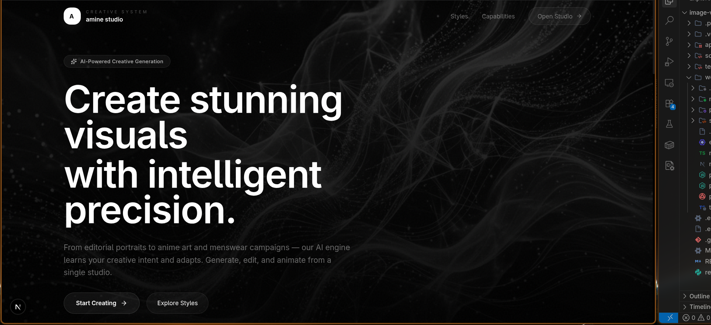
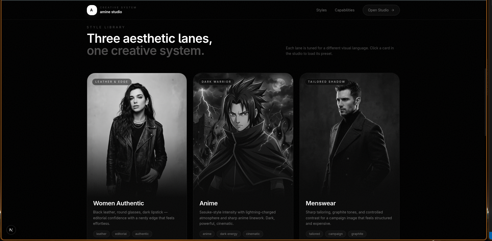

<p align="center">
  
</p>

<h1 align="center">amine studio</h1>

<p align="center">
  <strong>AI-powered creative generation studio — generate images, edit photos, and create videos from a single workspace.</strong>
</p>

<p align="center">
  
  
  
  
  
  
  
  
</p>

---

## ✨ Features

| Feature | Description |
|---|---|
| **Image Generation** | Generate images from text prompts using Google Imagen 4 via Replicate |
| **Image Editing** | Upload a photo and describe edits — the AI applies style changes, background swaps, and more |
| **Video Generation** | Turn a still frame into a 6-second video using Minimax video-01 |
| **Style Presets** | Three curated aesthetic lanes: Women Authentic, Anime, and Menswear |
| **B&W Design** | Premium black-and-white UI with grayscale images that reveal color on hover |
| **LTX-Inspired Effects** | Parallax hero, scroll animations, text shimmer, film grain, floating orbs |
| **Separate Landing + Studio** | Clean storytelling on `/` and focused creation on `/studio` |

## 📸 Media Showcase

### Application Walkthrough Video
<div align="center">
  <video src="https://github.com/aminammar1/ai-media-studio-app/raw/main/web/public/screenshots/video.mp4" controls="controls" width="100%"></video>
</div>

### Interface Screenshots
<p align="center">
  
  &nbsp;
  
</p>

## 🏗️ Tech Stack

### Frontend
- **[Next.js 16](https://nextjs.org/)** — React framework with App Router and Turbopack
- **[React 19](https://react.dev/)** — UI component library
- **[TypeScript](https://www.typescriptlang.org/)** — Type-safe JavaScript
- **[Tailwind CSS 4](https://tailwindcss.com/)** — Utility-first CSS
- **[Framer Motion](https://www.framer.com/motion/)** — Scroll-triggered animations and transitions
- **[Lucide React](https://lucide.dev/)** — Icon library

### Backend
- **[FastAPI](https://fastapi.tiangolo.com/)** — Python API server
- **[Uvicorn](https://www.uvicorn.org/)** — ASGI server
- **[Replicate](https://replicate.com/)** — AI model hosting (Imagen 4 + video-01)

### AI Models
| Model | Provider | Use |
|---|---|---|
| `google/imagen-4` | Replicate | Image generation + editing |
| `minimax/video-01` | Replicate | Image-to-video generation |

## 🚀 Getting Started

### Prerequisites

- **Python 3.15+**
- **Node.js 20+**
- **Replicate API Token** — [Get one here](https://replicate.com/account/api-tokens)

### 1. Clone the repo

```bash
git clone <your-repo-url>
cd image-video-ai-app
```

### 2. Set up environment

```bash
cp .env.example .env
# Edit .env and add your REPLICATE_API_TOKEN
```

### 3. Install dependencies

```bash
make install
```

### 4. Run the dev server

```bash
make dev
```

This starts both:
- **Backend** at `http://localhost:8000`
- **Frontend** at `http://localhost:3000`

## 📁 Project Structure

```
image-video-ai-app/
├── app/                    # FastAPI backend
│   ├── api/                # API routes
│   ├── providers/          # AI provider integrations
│   ├── services/           # Business logic
│   ├── config.py           # Configuration
│   ├── main.py             # FastAPI app entry
│   └── schemas.py          # Request/response schemas
├── web/                    # Next.js frontend
│   ├── public/             # Static assets (images, screenshots)
│   ├── src/
│   │   ├── app/            # App Router pages + API routes
│   │   │   ├── api/        # Next.js API routes (image, edit, video)
│   │   │   ├── studio/     # Studio page
│   │   │   ├── globals.css # Global styles
│   │   │   ├── layout.tsx  # Root layout
│   │   │   └── page.tsx    # Landing page
│   │   ├── components/     # React components
│   │   │   ├── ui/         # Shadcn-style primitives
│   │   │   ├── landing-page.tsx
│   │   │   └── studio-panel.tsx
│   │   └── lib/            # Utilities, API helpers, model config
│   └── package.json
├── scripts/                # Utility scripts
├── tests/                  # Backend tests
├── Makefile                # Dev commands
├── requirements.txt        # Python dependencies
└── README.md
```

## 🛠️ Available Commands

| Command | Description |
|---|---|
| `make install` | Install all Python + Node dependencies |
| `make dev` | Start backend + frontend together |
| `make run-api` | Start FastAPI backend only |
| `make run-web` | Start Next.js frontend only |
| `make test` | Run backend tests |
| `make live-test` | Run live Replicate model test |
| `make check-token` | Validate Replicate API token |
| `make web-build` | Production build of Next.js |
| `make web-lint` | Lint the frontend |
| `make clean` | Remove all caches and build output |

## 📄 License

MIT

---

<p align="center">
  <sub>Built with 🖤 by amine</sub>
</p>
